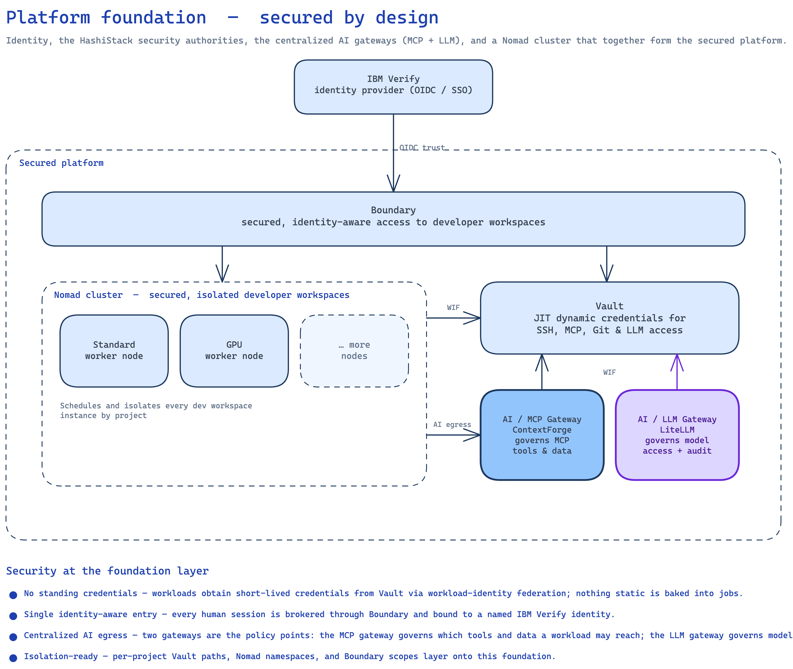
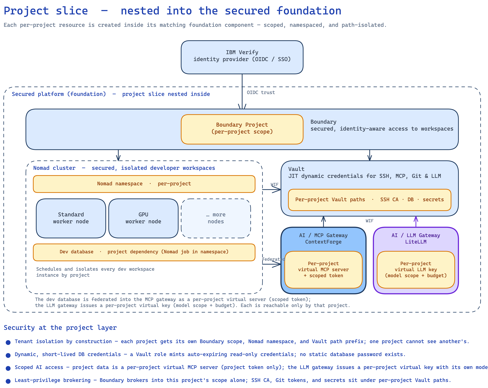
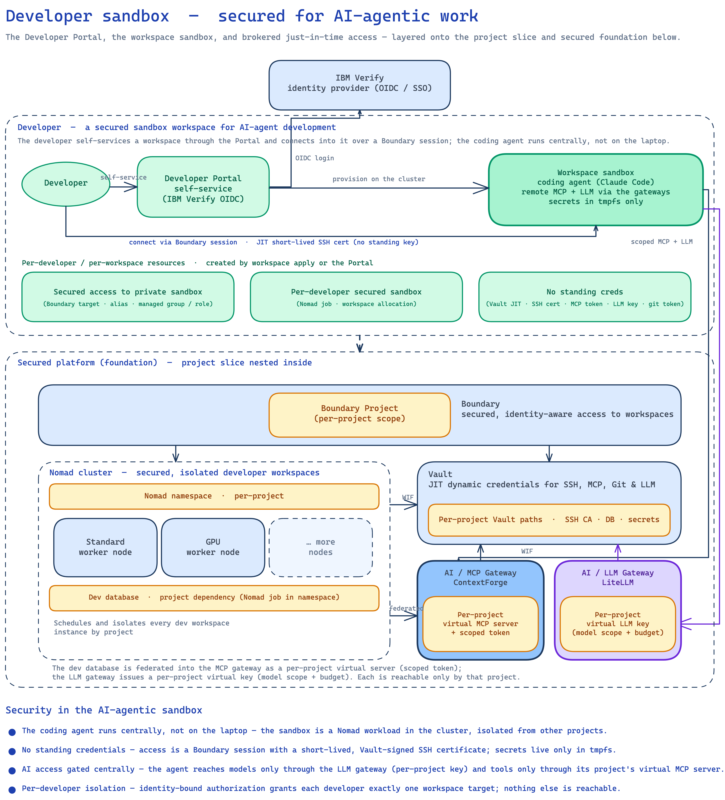

# Architecture — Secured Remote Dev Workspace

A central, secured remote development environment built on **IBM** and **HashiCorp** technology: the **HashiCorp** stack (**Boundary**, **Nomad**, **Vault**) for access, scheduling, and credentials, with **IBM Verify** as the identity provider. Developers do **not** install AI coding tools or run dev environments on their laptops. Instead a dev workspace runs centrally on the cluster, and developers connect their IDE (VSCode Remote-SSH) through an authenticated, authorized **Boundary** session — holding no SSH key of their own.

The **HashiCorp and IBM stack is the recommended foundation**, and two of its layers also adapt to a customer's existing estate. Workspace **scheduling and isolation** run on **Nomad** here; where **Kubernetes** is already the house standard, the same design maps directly onto it. The identity provider is **IBM Verify**, with any OIDC-compliant IdP able to stand in where one is already in place. The design is standards-based — it needs only a scheduler with namespaces and an OIDC IdP with standard claims — so it slots into what a customer already runs rather than forcing a rebuild.

## Security model

The architecture is organized around a small set of security properties. Each component and provisioning step described below exists to uphold one of them.

**Identity & access**

- **Boundary is the only way in.** The workspace `sshd` is **never** exposed to the network. The only path to it is Boundary's worker proxy. Off-box, the SSH port is unreachable.
- **Identity-bound, least-privilege authorization.** Developers authenticate with **IBM Verify SSO**. A per-developer Boundary managed group (matched on the `/token/email` claim) maps to a role granting `authorize-session` on **only that developer's** workspace target — proven by a negative-isolation test (a second developer is denied the first's target).

**Just-in-time credentials — no standing secrets**

- **Zero standing SSH keys — just-in-time, short-lived certificates.** The workspace `sshd` trusts *only* a Vault SSH certificate authority (`TrustedUserCAKeys`, with `AuthorizedKeysFile none` so static keys are inert). Boundary brokers each session and injects a freshly **short-lived** Vault-signed certificate, stamped with the developer's email as `key_id` for audit. There is no key to steal, leak, or rotate.
- **Workload identity, not shared secrets.** Nomad fetches the project's SSH CA public key from Vault over **workload-identity federation** (the `jwt-nomad` auth method) — no static Vault token is baked into a job. The Boundary credential store authenticates with a dedicated **least-privilege periodic token**, never the root token.
- **Ephemeral git push credential — no static PAT.** Git comes pre-configured for the logged-in developer, and the push credential is a **short-lived GitHub App installation token** minted on demand by Vault (the external GitHub secrets plugin) from a **pre-scoped, per-project permission set** (`contents:write`), reached over the same WIF path. consul-template re-mints it before expiry; it is rendered only to the task's **tmpfs**, never to the persistent `/home/dev` volume, and the App private key lives only in Vault. Commits are authored by the developer; the push is the App bot.

**Isolation & blast-radius containment**

- **No code or credentials on the laptop.** The source tree, the build toolchain, and the AI coding tools all live in a central container. A lost or compromised laptop carries no repo and no long-lived secret.
- **Tenant isolation by construction.** Each project gets its own **Vault path** (`ssh/<project>`, or optionally a dedicated **Vault namespace**), its own **Boundary project scope**, and its own **Nomad namespace**. Cross-project access is structurally impossible, not just policy-gated.
- **Defense in depth.** A namespace-scoped Nomad ACL policy + binding rule backstops the design even though developers never receive a Nomad token.

**Centralized AI egress — tools, data, and models**

- **Centralized, scoped AI tool/data access.** The coding agent reaches MCP tools and data **only** through the **ContextForge AI/MCP gateway**, with a client token scoped to its project's virtual MCP server — every other server and the admin API are denied. AI egress is one governed, auditable choke point, not per-workspace point-to-point access.
- **Governed LLM access — no provider key in the workspace.** The coding agent's model calls go **only** through the **LiteLLM AI gateway**, which holds the one central provider key; each workspace authenticates with a per-project **virtual key** (scoped to allowed models, with a budget and rate limit) and never sees the real key. Every prompt/response is audited centrally, and the provider is swappable (DeepSeek → watsonx.ai) by one config line — without touching a workspace.

## Architecture

```
IBM Verify (SSO)
      │  authenticate + authorize (group → role)
      ▼
Developer client (VSCode Remote-SSH · ssh · JetBrains)
      │  Boundary transparent session  (Client Agent / boundary connect ssh)
      ▼
Boundary worker proxy ──────────────► Dev workspace (Nomad job, Docker container)
      │  injects short-lived Vault-signed cert   sshd trusts only the Vault SSH CA
      ▼                                          /home/dev on a persistent host volume
Vault  ── signs SSH cert per session (key_id = developer email)
       ── SSH CA per project (ssh/<project>), reached by Nomad over WIF
```

The flow reads top to bottom:

- **Authenticate.** The developer signs in with **IBM Verify** (SSO). No SSH key, host address, or standing credential is ever handed to the laptop.
- **Authorize & broker.** **Boundary** matches the developer's identity to a role scoped to exactly one workspace and brokers the session through its worker proxy — the only network path to the workspace.
- **Inject a short-lived credential.** Boundary injects a **short-lived Vault-signed SSH certificate** into the connection. The workspace `sshd` trusts only the project's Vault SSH CA, so that certificate is the sole accepted credential.
- **Reach the workspace.** The workspace is a scheduled job (on **Nomad**, or **Kubernetes**) with a persistent `/home/dev` volume, reachable only through the Boundary proxy and never directly on the network.

When the workspace is **created** it comes **pre-configured** so the developer can code immediately — every credential minted just-in-time by **Vault** and rendered only to in-memory **tmpfs** (`/secrets`), never to the persistent volume:

- **Git push credential.** Git is wired to the logged-in developer's identity, and pushes use a **short-lived GitHub App installation token** (pre-scoped `contents:write`) served from tmpfs by a credential helper — no static PAT.
- **Project MCP server.** The agent is pre-registered with **only its project's virtual MCP server** on the **ContextForge AI/MCP gateway**, using a per-project **scoped client token** from tmpfs — so its tool and data access is governed centrally, not embedded.
- **Governed LLM access.** The agent's `ANTHROPIC_BASE_URL` points at the **LiteLLM AI gateway** and its API key is a per-project **virtual key** served from tmpfs — so model calls are centrally audited and budget/scope-limited, and the real provider key never reaches the workspace.

## Component roles

Each product in the stack owns one part of the security model:

- **Boundary — identity-aware access broker.** The single, authenticated entry point to every workspace. It performs authorization (per-developer managed group → role → `authorize-session` on exactly one target), brokers the session through its worker proxy, and injects the session credential — so the workspace `sshd` is never network- reachable and the developer never learns a host address or holds a key. Target aliases
  + the Client Agent make this transparent to VSCode Remote-SSH.

- **Vault — central credential authority & secrets store.** Far more than a certificate authority — Vault mints every short-lived credential and holds the platform's secrets. As the **SSH certificate authority** it signs a fresh, short-lived, per-session SSH certificate (`key_id` = developer email, for audit) from a per-project CA (`ssh/<project>`), so credentials never cross project boundaries. As the **git push credential authority** the external GitHub secrets plugin mints short-lived GitHub App installation tokens from a per-project, pre-scoped permission set, so no static PAT is stored anywhere and the App private key never leaves Vault. It also issues **dynamic, auto-rotating database credentials** (a per-project read-only Postgres role — no static password), and its **KV store** holds each project's job templates and the gateway's scoped MCP token (`secret/projects/<project>/…`). Nomad reaches Vault over **workload-identity federation** (no static token) for these; Boundary's credential store uses a dedicated least-privilege periodic token rather than the root token.

- **Nomad — workload scheduler / isolation boundary.** Runs each developer workspace as a managed container with a persistent host volume (work survives stop/start + reboot), and partitions tenants by **namespace** (one per project) backstopped by a namespace-scoped ACL. It pulls each project's CA public key from Vault at launch via workload identity, so the trust chain is established without embedding secrets. The same model maps directly onto **Kubernetes** — namespaces, scheduled pods, and persistent volumes — wherever that is the house scheduler.

- **IBM Verify — identity provider.** The SSO source of truth. Both Boundary and Nomad trust it via OIDC; per-developer authorization is derived from the `/token/email` claim (also the certificate `key_id`), so access is always bound to a named person. Any OIDC-compliant IdP can stand in its place — the design relies only on standard OIDC claims, not on a specific vendor.

- **AI / MCP Gateway (ContextForge) — centralized AI tool/data egress.** A single platform-tier service (a Nomad job in the `infra` namespace, IBM `mcp-context-forge`) that federates each project's MCP server as a **per-project virtual MCP server** and is the one policy point deciding which MCP servers and tools a workspace may reach. A workspace holds only a **scoped client token** that reaches its own virtual server and nothing else, so AI tool/data access is centralized and auditable rather than wired point-to-point between workspaces and data sources.

- **AI / LLM Gateway (LiteLLM) — centralized, governed model egress.** A second platform-tier service (a Nomad job in the `infra` namespace, backed by Postgres) that every workspace's Claude Code calls instead of the model provider directly. It serves the Anthropic `/v1/messages` API, holds the **one central provider key**, and issues each project a scoped **virtual key** (allowed models + budget + rate limit). It is the one policy and audit point for model access: every prompt/response is logged per project, and the provider is swappable (DeepSeek → watsonx.ai) by a one-line config change with no workspace edit.

The chain in one line: **IBM Verify** says *who you are*, **Boundary** decides *whether you may connect and brokers it*, **Vault** mints *the short-lived credentials*, **Nomad** runs *the workspace you reach*, and the **AI gateways** govern *which tools, data, and models that workspace may use* (MCP gateway for tools/data, LLM gateway for model access).

## AI / MCP Gateway (ContextForge)

Every workspace runs an **AI-agentic** coding agent that reaches **tools and data over MCP**. That access is governed centrally — one auditable choke point instead of point-to-point integrations wired into each workspace.

- **One gateway, per-project virtual servers.** A single platform-tier gateway — IBM **`mcp-context-forge`**, a Nomad job in the `infra` namespace — federates each project's MCP server as a **peer** and composes its tools into a **per-project virtual MCP server**. A workspace is issued a **client token scoped to its own virtual server**, so it reaches that server's tools and nothing else (every other server and the admin API return `403`).
- **MCP access is the policy point.** Which MCP servers and tools a workspace may reach is decided here, centrally, not embedded in the workspace. Project onboarding registers the peer + virtual server and writes the workspace's gateway URL + scoped token to Vault (`secret/projects/<project>/mcp`); the workspace renders both to tmpfs and the agent is pre-registered against that one server.
- **What the project exposes.** In the reference project the federated MCP server is a read-only Postgres service (`demo-db-mcp`) whose database credential is a **dynamic, auto-rotating Vault role** — no static DB password — surfaced to the workspace as that project's virtual server.

## AI / LLM Gateway (LiteLLM)

The coding agent's **model** calls are governed the same way its MCP calls are — through one central, auditable gateway rather than a provider key baked into each workspace.

- **One gateway, per-project virtual keys.** A single platform-tier gateway — **LiteLLM**, a Nomad job in the `infra` namespace backed by Postgres — serves the Anthropic `/v1/messages` API that Claude Code speaks, and maps the workspace-facing model names (`deepseek-v4-pro`/`deepseek-v4-flash`) to the real backend. It holds the **one central provider key**; each project is issued a **virtual key** scoped to its allowed models, with a budget and rate limit. A workspace authenticates with its virtual key and never sees the provider key.
- **Model access is the policy point.** Which models a workspace may call, how much it may spend, and how fast are decided here, centrally. Project onboarding mints the virtual key and writes it (with the gateway URL) to Vault (`secret/projects/<project>/llm`); the workspace renders both to tmpfs and Claude Code's `ANTHROPIC_BASE_URL` + `apiKeyHelper` use them — so the developer sees no change.
- **Audited and provider-portable.** Every prompt/response is recorded in the gateway's spend logs, tagged with the project — the hook for SIEM forwarding. Switching providers (DeepSeek today → **watsonx.ai**) is a one-line `model_list` change in the gateway config, with no workspace edit. And because all model egress flows through this one node, workspace egress to the provider can be locked down to the gateway alone.

## Three tiers, three roles

The Terraform is split into three independently-applied tiers under `terraform/`, each owned by a different role and applied in order. This separation is the operational form of least privilege — the **Platform Admin** holds the privileged tokens, **Project Admins** onboard their own projects, and **Developers** only ever provision and reach their own workspace.

Crucially, **developers never touch Terraform at all.** They create and reach a workspace through the self-service **Developer Portal** — sign in with SSO, pick a project flavor from a web UI, and click create. No HCL to write, no state to manage, no tokens to handle. The `terraform/workspace` tier below is the equivalent operator path to the same result, but the everyday developer experience is the Portal.

| Tier | Path | Role | Cadence | Creates |
|------|------|------|---------|---------|
| **Platform** | [`terraform/infra/`](terraform/infra/) | Platform Admin | **Once** | Boundary/Nomad/Vault clusters, IBM Verify OIDC + SSO, Boundary **org** scope, shared Nomad↔Vault WIF auth method, Vault KV mount |
| **Project** | [`terraform/project/`](terraform/project/) | Project Admin | **Per project** | Boundary project **scope**, Nomad **namespace**, per-project Vault SSH CA + signing role, Boundary cred store + SSH credential library, per-project WIF role, namespace ACL, job templates in Vault KV |
| **Developer** | [`terraform/workspace/`](terraform/workspace/) | Developer | **Per workspace** | Workspace container (Nomad job + persistent host volume), Boundary target/alias + per-developer managed group/role, `~/.ssh/config` snippet |

In this **build**, per-instance state is kept with the CLI's `terraform workspace` (one per project / per developer-workspace), and the lower roots read each upstream tier's outputs via `terraform_remote_state`, so there is **no token or address copying** between tiers.

For **production**, the recommended practice is **HCP Terraform** or **Terraform Enterprise**: each tier-instance becomes its own remote workspace with managed, locked, encrypted state; the three roles map to workspace **teams / RBAC**; runs are guarded by **policy-as-code** (Sentinel/OPA); and cross-tier outputs are shared natively via the `tfe_outputs` data source instead of raw `terraform_remote_state`. (An HCP/TFE *workspace* is a remote state-and-run unit — distinct from the CLI `terraform workspace` used here.)

## Logical architecture by persona

The architecture composes **cumulatively** across three layers — a platform foundation, an isolated project slice, and a developer sandbox — each owned by a different role. The diagrams below are logical views: they show the design pattern rather than a specific deployment topology — node counts, high availability, and network layout are abstracted away, and an actual production deployment should follow HashiCorp's recommended production deployment architectures and hardening guidance. Each diagram builds on the one before it and is followed by a table describing the role each component plays in the security model.

### Platform Admin — foundation

The foundation provides identity, the HashiStack security authorities, a Nomad cluster of standard and GPU worker nodes, and the centralized **AI gateways** (MCP + LLM). IBM Verify is the identity provider both Boundary and Nomad trust; Boundary is the single, identity-aware entry to every workspace; Vault is the authority for all just-in-time credentials; and the gateways are the one policy point governing which MCP servers, tools, and LLMs any workload may reach.



| Component | Role in the security model |
|---|---|
| **IBM Verify (SaaS)** | OIDC/SSO identity provider that both Boundary and Nomad trust; every access is bound to a named person (the `/token/email` claim). |
| **Boundary** | Identity-aware access broker — the org scope + OIDC auth method; brokers each workspace session and injects its credential, so no workspace is directly network-reachable. |
| **Vault** | Central credential authority & secrets store — the `secret/` KV mount and the `jwt-nomad` workload-identity auth method; mints every short-lived credential for SSH, database, Git, and MCP access. |
| **Nomad cluster** | Workload scheduler and isolation boundary — standard and `gpu` node pools that run every workload, including the gateway itself. |
| **AI / MCP Gateway (ContextForge)** | The centralized MCP policy point (Nomad job, namespace `infra`) — governs which MCP servers and tools a workspace may reach. |
| **AI / LLM Gateway (LiteLLM)** | The centralized model-egress policy point (Nomad job + Postgres, namespace `infra`) — holds the one central provider key, issues per-project virtual keys (model scope + budget + rate limit), and audits every prompt/response. |
| **Workload identity** | Nomad reaches Vault over workload-identity federation, so no static tokens are baked into jobs. |

### Project Admin — project slice

Each project is carved out as an **isolated slice** on top of the foundation: a Boundary scope, a Nomad namespace, per-project Vault paths, a project database with its own MCP service federated into the MCP gateway as a per-project **virtual MCP server** (reachable only with a scoped client token), and a per-project **virtual LLM key** issued by the LLM gateway (scoped to allowed models, with a budget and rate limit). Tenant isolation is structural — by scope, namespace, and Vault path prefix — rather than policy-gated.



| Component | Role in the security model |
|---|---|
| **Boundary project scope** | Per-project scope + credential store / SSH credential library (a least-privilege periodic token), isolating brokered access to this project. |
| **Nomad namespace** | Per-project namespace (ACL-backstopped) partitioning every workload, so projects cannot schedule into one another. |
| **Per-project Vault paths** | `ssh/<project>` (SSH CA), `database/<project>` (dynamic read-only Postgres role), `github/<project>` (GitHub App token broker), `secret/projects/<project>/*` (KV) — isolation by path (a per-project Vault namespace is an alternative — see note below). |
| **demo-db + demo-db-mcp** | A Postgres database and a long-running postgres-mcp (SSE) service whose DB credential is a dynamic, auto-rotating Vault read-only role — no static DB password. |
| **Gateway virtual server + scoped token** | demo-db-mcp is registered as a gateway peer and exposed as a per-project virtual MCP server; a scoped client token (written to `secret/projects/<project>/mcp`) reaches only that server. |
| **Per-project LLM virtual key** | The LLM gateway issues each project a scoped virtual key (allowed models + budget + rate limit, written to `secret/projects/<project>/llm`); the workspace authenticates with it and never sees the central provider key. |

> **Path prefixes vs. Vault namespaces.** This build isolates projects by **path prefix** within a single Vault namespace (`ssh/<project>`, `database/<project>`, `secret/projects/<project>/*`), governed by per-project policies. **Vault Enterprise namespaces** are an alternative that places each project in its own namespace — with separate secrets engines, policies, auth methods, and identity — for a stronger administrative boundary and delegated, self-service project administration. Both fit the per-project tier; choose based on your organization's tenancy, delegation, and compliance requirements. Switching to namespaces also moves the per-project auth methods and policies — including the `jwt-nomad` workload-identity federation Nomad relies on — into each project's namespace, which the project tier would provision per-namespace.

### Developer — sandbox

A developer self-services a workspace through the **Developer Portal** (or the equivalent `terraform/workspace` path), which renders it from the same Vault-KV job template. The coding agent runs centrally in the sandbox container — not on the laptop — reaching tools and data only through its project's virtual MCP server, and models only through the LLM gateway with a per-project virtual key. Access is a Boundary session carrying a just-in-time, short-lived Vault-signed SSH certificate, so the developer holds no key and secrets render only to in-memory tmpfs.



| Component | Role in the security model |
|---|---|
| **Developer Portal** | Self-service trusted backend (IBM Verify OIDC); shows only the projects the developer's groups grant and provisions the workspace over the Nomad/Boundary/Vault APIs. |
| **Workspace container** | The AI-agentic sandbox — a Nomad job running the Claude Code coding agent with a persistent `/home/dev` volume; secrets render only to **tmpfs `/secrets`**, never to the volume. |
| **Boundary target + per-developer group/role** | An email-bound managed group authorizes exactly one workspace target (negative-isolation tested); the workspace `sshd` is never exposed to the network. |
| **JIT Vault SSH certificate** | Boundary injects a fresh short-lived Vault-signed certificate (`key_id` = developer email) per session — the developer holds no SSH key to steal or rotate. |
| **Remote MCP via the gateway** | Claude connects to the project's virtual MCP server with the scoped token from tmpfs — AI tool/data access is gated centrally by gateway policy, not embedded per workspace. |
| **Governed LLM via the gateway** | Claude Code's `ANTHROPIC_BASE_URL` points at the LiteLLM gateway and authenticates with a per-project virtual key from tmpfs — model access is centrally audited and budget/scope-limited; the real provider key never reaches the workspace. |

## Provisioning sequence (by role)

The tiers apply in a strict order — **platform → project → developer**. Vault is unsealed for the project and developer applies and for every connection, since Boundary signs each session certificate through Vault.

### 1. Platform Admin — once

The platform tier stands up the clusters, SSO, and shared trust anchors. Full instructions: [`terraform/infra/README.md`](terraform/infra/README.md).

```bash
cd terraform/infra
# Add Boundary/Nomad/Vault Enterprise licenses under config/ (gitignored).
# Build the base AMI (Packer) — see the platform README.
cp terraform.tfvars.example terraform.tfvars     # base values + IBM Verify tenant/API creds
terraform init
terraform apply -target=module.secured_codespace  # bring the base node up first
terraform apply                                    # IBM Verify OIDC + WIF auth method + KV mount
```

Outputs the lower tiers consume: `boundary_addr`, `nomad_addr`, `vault_addr`, `org_scope_id`, admin login/password + `admin_auth_method_id`, the OIDC method IDs, the WIF backend path, and the KV mount path. After this apply, SSO login works for both Boundary and Nomad, Vault is unsealed with the KV mount + `jwt-nomad` present, and the Boundary org scope exists (no project scope yet).

> IBM Verify prerequisites (a SaaS tenant, a bootstrap API client, and the admin/readonly groups) are one-time and described in the platform README. The `ibm_verify_*` variables have no defaults and are set before any apply.

### 2. Project Admin — per project

The project tier onboards a project — its own Boundary scope, Nomad namespace, Vault SSH CA, credential store/library, WIF role, namespace ACL, and job templates. Full instructions: [`terraform/infra/README.md` → Project onboarding](terraform/infra/README.md#project-onboarding-terraformproject).

```bash
cd terraform/project
terraform init
cp terraform.tfvars.example project-acme.tfvars   # set project_name + developers_group_name
terraform workspace new project-acme               # one Terraform workspace per project
terraform apply -var-file=project-acme.tfvars
```

The project tfvars also carry the project's **GitHub App** (App ID, installation ID, private-key PEM) — a one-time manual prerequisite per project (create the App with **Contents: Read & write**, install it on the repos). This tier configures the `github/<project>` token broker + a pre-scoped `dev-workspace` permission set from them.

Each project is fully isolated — separate Vault path (`ssh/project-acme`), Boundary scope, Nomad namespace, and GitHub App. Additional projects are onboarded by repeating with a new workspace + tfvars. The job template is readable at `secret/projects/<project>/job-templates/<name>` and the outputs (`project_scope_id`, `namespace`, `credential_library_id`, `ssh_ca_path`, `wif_role`, `github_token_path`, …) feed the developer tier.

### 3. Developer — per workspace

The developer provisions their own workspace from a selected project flavor. There are two paths to the **same** result — the workspace container, the Boundary target/alias, and the per-developer authorization — and most developers use the Portal:

| | **Developer Portal** (default) | **Terraform** (`terraform/workspace/`) |
|---|---|---|
| Audience | Every developer — self-service | Operators / CLI automation |
| Interface | Web UI: sign in with SSO, pick a project flavor card, click **Create** | `terraform apply` with a per-developer tfvars + Terraform workspace |
| Terraform knowledge | None | Required (tfvars, `terraform workspace`, plan review) |
| What the developer chooses | A project flavor card | `job_template_name` (default `dev-workspace`) |
| Image & repo | Pinned by the project — nothing to set | Pinned by the project — nothing to set |
| GPU flavor | Lands on a GPU node automatically | Lands on a GPU node automatically |
| Produces | Workspace container + Boundary target/alias + per-developer managed group/role | The same resources |

For the **self-service path**, see [Developer Portal](#developer-portal). For the **operator path**, full instructions and verification gates are in [`terraform/workspace/README.md`](terraform/workspace/README.md):

```bash
cd terraform/workspace
# The flavor's image is built + pushed by the PROJECT tier (see the project README) — not here.
terraform init
cp terraform.tfvars.example ravi-main.tfvars       # developer_handle/email, project_name, ssh_port, (optional) job_template_name
terraform workspace new ravi-main                  # one Terraform workspace per developer-workspace
terraform apply -var-file=ravi-main.tfvars -out=ravi-main.tfplan   # review the saved plan, then apply
```

### 4. Developer — connect

The developer authenticates with **IBM Verify SSO** and connects with **no SSH key** — Boundary brokers the session and injects a short-lived Vault-signed certificate.

```bash
# SSO-authenticate to Boundary (browser OIDC flow), then either:
boundary connect ssh -target-id <target-id> -- whoami        # CLI fallback
# ...or VSCode Remote-SSH over the Boundary Client Agent (transparent sessions) —
# plain `ssh <ws>.<dev>.<project>.boundary`, no ProxyCommand. See the workspace README.
```

The negative-isolation gate (a second developer is **denied** the first's target) and the off-box reachability gate (the SSH port is unreachable except via Boundary) are documented and verified in [`terraform/workspace/README.md`](terraform/workspace/README.md).

## Developer Portal

Developers don't run Terraform to get a workspace — they use the **Developer Portal** (`portal/`), a self-service web app that provisions a workspace in a few clicks. It is the everyday developer interface, producing the same per-workspace result as the `terraform/workspace` tier.

- **Sign in.** The developer authenticates with **IBM Verify SSO** and sees only the projects they are entitled to — nothing they cannot access.
- **Pick a flavor.** Each project offers one or more **flavor cards** (a label, description, and capability tags); the developer picks one and creates the workspace. The repository and image are pinned by the project, so there is nothing to configure — no image, no repo, no Terraform. A GPU flavor lands on a GPU node automatically.
- **Connect.** Each workspace card carries copy-paste **VSCode Remote-SSH** instructions; a small local helper runs the Boundary login and manages the SSH config entry for you.

## Teardown (destroy the environment)

Teardown runs in the **reverse** of the apply order — **developer → project → platform** — so the Boundary/Nomad/Vault control planes each tier talks to remain up until the platform node is torn down last. Vault is unsealed for the developer and project destroys, which revoke Boundary/Nomad/Vault resources through those APIs; a sealed Vault makes them hang or error. `terraform destroy` prints a plan and prompts before deleting, and on the shared clusters the plan is reviewed rather than applied with `-auto-approve`.

### 1. Developer workspaces — Portal (everyday) or Terraform (bulk)

Developers normally tear down their own workspace from the **Developer Portal** — the per-workspace **Delete** action runs the same teardown for a single workspace: it purges the Nomad job, deletes the home volume (**all `/home/dev` data is lost**), removes the Boundary target/alias, and drops the local `~/.ssh/config` entry. Each developer can only delete a workspace they own. Use the Terraform path below for bulk teardown — every workspace at once, or as the first step of a full environment destroy:

```bash
cd terraform/workspace
terraform workspace list                          # every developer-workspace
terraform workspace select ravi-main
terraform destroy -var-file=ravi-main.tfvars      # review the plan, confirm
# repeat for each remaining workspace (pravi-main, …)
```

Removes the workspace container **and its host volume — all `/home/dev` data is lost** — plus the Boundary target/alias and the per-developer managed group/role.

### 2. Projects — each project Terraform workspace

```bash
cd ../project
terraform workspace select project-acme
terraform destroy -var-file=project-acme.tfvars   # review, confirm
# repeat for each project
```

Removes the Boundary project scope, Nomad namespace, Vault SSH CA, credential store/library, WIF role, namespace ACL, and the `github/<project>` token broker. The project's **GitHub App is external** (not Terraform-managed) — it survives; delete it in GitHub manually only if you are decommissioning the project for good.

### 3. Platform — last

```bash
cd ../infra
terraform destroy                                 # review, confirm
```

Tears down the EC2 node and the Boundary/Nomad/Vault clusters, and the IBM Verify OIDC **apps** (recreated on the next apply). The IBM Verify **tenant** itself is external and untouched.

Order matters: the platform tier cannot be torn down while any project or developer state still exists, because those tiers' providers read the platform's addresses and credentials from its state — with no control plane left to call, their destroys fail. The lower tiers are always emptied first.

Once a tier's resources are gone, the now-empty per-instance state can be dropped (`terraform workspace select default && terraform workspace delete <name>`), and the gitignored `*.tfvars` and `*.tfplan` files removed.

## Repository layout

```
.
├── terraform/
│   ├── infra/          # PLATFORM tier (once) — clusters, IBM Verify SSO, org scope, WIF, KV,
│   │   │               #   GitHub secrets-plugin registration (vault-github-plugin.tf), and the
│   │   │               #   AI gateways: mcp-gateway.tf (ContextForge MCP) · llm-gateway.tf (LiteLLM + Postgres)
│   │   ├── ami/        # Packer images: base_image (Boundary/Nomad/Vault/Consul +ent + baked
│   │   │               #   GitHub plugin) and gpu_image (NVIDIA driver + toolkit + device plugin)
│   │   ├── config/     # cluster HCL, systemd units, licenses
│   │   └── modules/    # secured-codespace (+ GPU worker, node_pool "gpu") · identity · nomad-vault-wif
│   ├── project/        # PROJECT tier (per project) — FLAT root (no child module);
│   │   │               #   github.tf = per-project GitHub App token broker
│   │   ├── templates/  #   Nomad job templates (raw HCL → Vault KV) — dev-workspace, gpu-workspace
│   │   └── images/     #   Dockerfile per flavor: dev-workspace/ + gpu-workspace/ (CUDA)
│   └── workspace/      # DEVELOPER tier (per workspace) — FLAT root (no child module)
└── portal/             # DEVELOPER PORTAL — self-service web app (direct-API equivalent of terraform/workspace)
    ├── backend/        #   Go: cmd/portal + internal/{config,auth,hashistack,descriptor,portgen,jobrender,workspace,api}; serves the SPA from web/
    ├── frontend/       #   Vite + React + @carbon/react (build output → backend/web)
    └── helper/         #   macOS secured-ws:// helper (Boundary login + ~/.ssh/config management)
```

> The `project/` and `workspace/` tiers are **flat** roots: each was a single-instance module wrapper, so the resources now live directly in the tier root (per-instance isolation comes from `terraform workspace`, not the module boundary). The `infra/` tier keeps its modules — they are genuinely distinct subsystems.

## Prerequisites

- AWS credentials in the environment (region defaults to `ap-southeast-1`).
- Packer ≥ 1.9, Terraform ≥ 1.9 (the developer tier renders job templates with `templatestring()`).
- Boundary, Nomad **and** Vault Enterprise licenses (the AMI bakes `+ent` binaries).
- An IBM Verify SaaS tenant + bootstrap API client (see the platform README).
- A **GitHub App per project** (Contents: Read & write), installed on the project's repos — supplies the workspace git push credential (see the project onboarding section).

## Operational constraints

- `*.tfvars`, plan files, and `generated/` artifacts embed the Boundary admin password and Vault/Nomad tokens; all are gitignored and are never committed.
- On the shared Boundary/Nomad/Vault clusters, changes are applied from a **saved, reviewed plan** (`terraform apply -out=<file>.tfplan`) rather than with `-auto-approve`, and the plan file is deleted afterward.
- Vault uses Shamir unseal, so it returns sealed after any node reboot and is re-unsealed before Terraform runs or connections are made (see the platform README).
- The workspace host volume lives on the node root EBS: data survives **stop/start + reboot**, but not instance replacement.
```